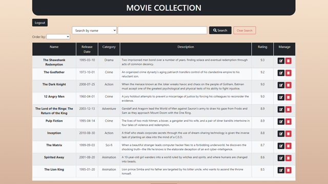
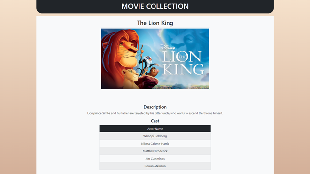

Movie Collection
================

General Info
------------
> Movie Collection is a Spring Boot Web Application using Spring Boot, Maven, JPA/Hibernate, Thymeleaf, Bootstrap, Spring Security, H2 Database.

### Features
* Add movies to the collection or Delete / Update movies from the collection.
* View movie entries (Name, Release Date, Description, Image, Rating, Cast)
* Login / Register to have access to viewing the collection or managing it.
* Authorization system, meaning that you have to be the admin to add/update/delete movies but viewing is accessable via a user role.

### How To Use
> #### What You Need
> Make sure port 8080 isn't in use.
* Download the files and make sure they're inside a folder. (Name can be anything)
#### TO RUN WITH AN IDE
> * On SpringToolSuite4 (or Eclipse), File -> Import -> Existing Maven Projects -> Choose the folder
> * When importing process is done, right-click on the root directory (from Package Explorer) Run As -> Spring Boot Application
#### TO RUN WITH THE .JAR FILE
> * After downloading the files, place the .jar file under the JAR folder anywhere you like.
> * Then open the terminal, navigate to the directory that the .jar file is in.
> * Type this command to run:  java -jar FILENAME.jar (in this case, java -jar movie-collection-0.0.1-SNAPSHOT.jar)
> * And to shutdown the app, while still in the terminal: press CTRL + C on Linux/Windows or press Command + . (period) on Mac. 

* Once the app runs, open your browser and type http://localhost:8080 as the url. You'll get redirected to the login page.
* You can register, then login. There are already two registered accounts in the app.
* **Username: user Password: user** for a normal user experince (same as a newly registered account)
* **Username: admin Password: admin** for an admin user experience (You can add, edit and delete movie entries with this account).

### Screenshots
> 
> 
